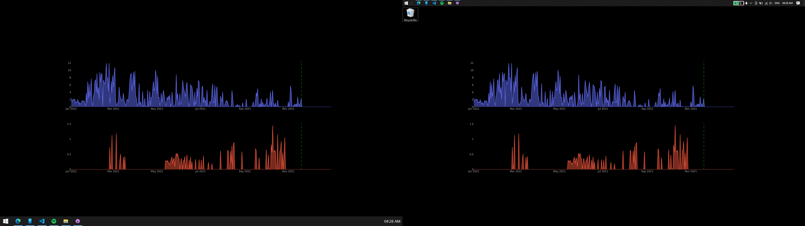

# Desktop Dashboards
### Bringing Dashboards to your desktop to let you keep track of things you want to keep track of - easily.

## The idea behind this project 
Having to open a different app to track some things is a little inconvenient since you can conveniently forget to open the app and forget to look at the stats you want to keep track of. To combat this - I brought the charts I want to see straight to the desktop. The desktop wallpaper is updated daily so I'm always up to date whenever I login to my pc to work or play games. As a bonus, I get a super cool wallpaper which is also functional!